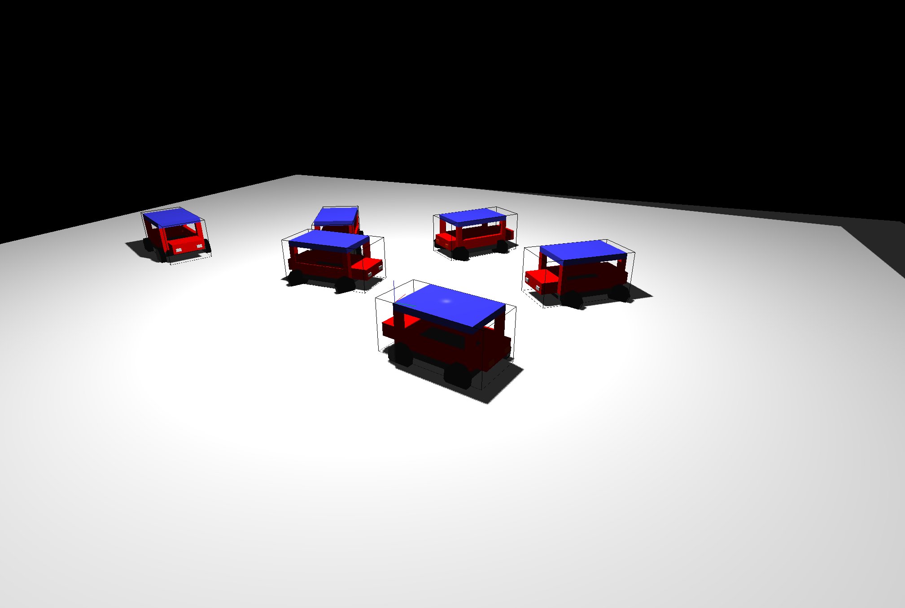

# Archive Readme
Final Computer Graphics project. Features a bunch of bumper cars ramming into each other. Written using C++ with [GLEW][glew] and [GLFW][glfw].




Requires VS2019 or XCode.

## Features
* Spotlights with shadows.
* Phong shading model.
* Discrete line intersection-based collision.
* First/third person cameras.
* A car.
* Another car.
* Square smoke particles.
* Folders (~~based on other final projects I've seen this is in fact a feature~~).


## License
Unless otherwise stated, this project is licensed under the zlib license. Please refer to the [LICENSE.md](LICENSE.md) file for more details.

Portions of the source are modified from code used in [juanjp600/pge](https://github.com/juanjp600/pge), which is also under the zlib license. Source files using said code have an explicit notice at the top of them.

# Original Readme Below

```
**** CONTROLS ****

W - Move forward.
A - Rotate wheels to the left.
S - Rotate wheels to the right.
D - Move backwards.

X - Toggles the rendering of textures on objects.
B - Toggles the shadow mapping algorithm.
K - Toggles the rendering of the depth map to the screen.

Mouse - Rotates camera.
F - Hold to enable moving the cursor.

H - Toggles bumber car AI.
C - Toggles first/third person view.
L - Toggles headlights and taillights.
```

[glew]: http://glew.sourceforge.net/
[glfw]: https://www.glfw.org/
